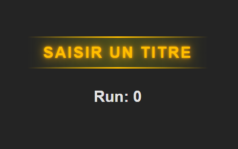
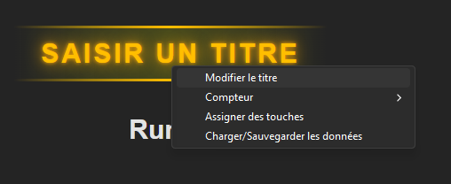
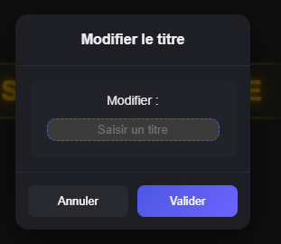
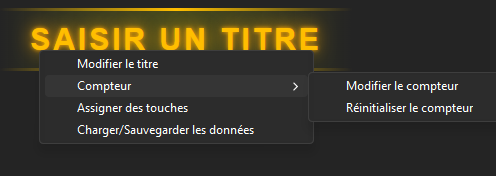
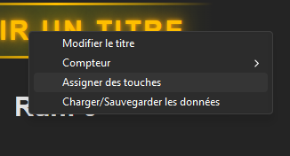
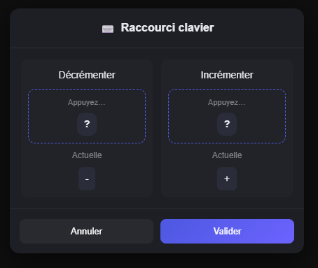
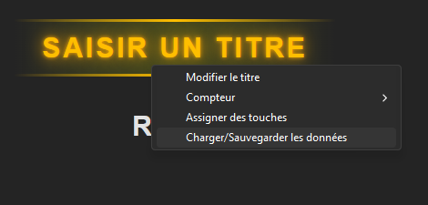
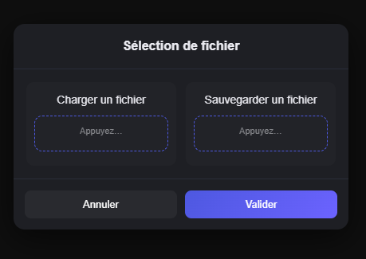

## 1 - Présentation

BL4 Tracker est une application de bureau légère conçue pour les joueurs de Borderlands 4 souhaitant suivre leur progression dans le farming.

L'application se présente sous la forme d'un compteur personnalisable accompagné d'un titre, permettant de garder un œil sur ses sessions de farm sans quitter le jeu.

## 2 - Fonctionnalités

- **Compteur personnalisable** — modifiez le titre et la valeur du compteur à votre convenance
- **Raccourcis clavier** — assignez vos propres touches pour incrémenter ou décrémenter le compteur sans effort
- **Sauvegarde et chargement** — sauvegardez votre configuration sur votre ordinateur et rechargez-la à tout moment pour reprendre là où vous en étiez


## 3 - Installation 

Pour installer l'application, il suffit de passer par l'[installateur](https://github.com/TheoLebreton72/BL4-tracker-app/releases/tag/0.1.0).

## 4 - utilisation 

L'application se présente comme ceci: <br/>


### 4.1 - Modifier le titre
Pour procéder à la modification du titre du compteur, il suffit simplement de faire un clic droit sur le compteur et sélectionner l'option "Modifier le titre".<br/>


Ce qui nous ouvre un onglet avec un champs permettant de modifier le titre a notre convenance pour ensuite valider la modification via le bouton **"Valider"** situé en bas de cet onglet.<br/>


### 4.2.1 - Modifier le compteur
Pour procéder à la modification de la valeur du compteur, c'est similaire au titre, il suffit de faire un clic droit sur le compteur et sélectionner l'option **"compteur"** puis l'option **"Modifier le compteur"** <br/>


### 4.2.2 - Réinitialiser le compteur
La réinitialisation du compteur se fait simplement via un clic droit sur le compteur -> sélection de l'option **"Compteur"** -> **"Réinitialiser le compteur"**<br/>


### 4.3 - Assignation de touches
L'application dispose d'une fonctionnalité permettant à l'utilisateur de choisir quelles touches assigner pour la décrémentation et l'incrémentation du compteur, les touches assignées par défaut sont "-" pour la décrémentation et "+" pour l'incrémentation.<br/>
La procédure est similaire aux autres actions, il suffit d'un clic droit sur le compteur puis sélectionner **"Assigner des touches"** <br/>
 <br/>

Ensuite, il suffit de cliquer avec un clic gauche de la souris dans le champs de gauche ou de droite pour enfin appuyer sur la touche du clavier que l'on souhaite assigner.<br/>



### 4.4 - Chargement/Sauvegarde de données
Pour finir, l'application dispose d'une fonctionnalité de chargement et de sauvegarde de données.<br/>
Via un clic droit sur le compteur il faut sélectionner l'option **"Charger/sauvegarder les données"**.<br/>
<br/>

Le fonctionnement est similaire à la fonctionnalité d'assignation de touches, il suffit de cliquer dans le champs de gauche pour charger un fichier de configuration présent sur son ordinateur, ou alors dans le champs de droite pour sauvegarder sa configuration de compteur sur son ordinateur.<br/>



## 5 - Compiler depuis la source

### 5.1 - Prérequis
Les prérequis suivants sont uniquement nécessaires si vous souhaitez compiler le projet vous-même. Si vous utilisez l'installateur disponible dans les [Releases](https://github.com/TheoLebreton72/BL4-tracker-app/releases/tag/0.1.0), aucun prérequis n'est nécessaire. :<br/>

| Outil   | Version recommandée | Description                                             |
|---------|---------------------|---------------------------------------------------------|
| Node.js | 24.x                | Gestion des dépendances et build du frontend React      |
| npm     | 11.x                | Gestionnaire de paquets javascript                      |
| Git     | 2.x                 | Gestion de version du code source                       |
| Rust    | 1.95                | Compilation du backend Tauri                            |
| Python  | 3.14                | Compilation du script de gestion des raccourcis clavier |

### 5.2 - Cloner le repository
```bash 
git clone https://github.com/TheoLebreton72/BL4-tracker-app.git
```
```bash
 cd .\BL4-tracker-app\
 ```

### 5.3 - Installer les dépendances
```bash
npm install
```

### 5.4 - Compiler le script Python
```bash
python -m PyInstaller --onefile --noconsole src/scripts/keybind.py
```
 Déplace ensuite le fichier `keybind.exe` généré dans `dist/` vers `src-tauri/binaries/` en le renommant `keybind-x86_64-pc-windows-msvc.exe`

### 5.5 - Compiler le projet
```bash
npx @tauri-apps/cli build
```

L'installateur sera généré dans `src-tauri/target/release/bundle/nsis/`.